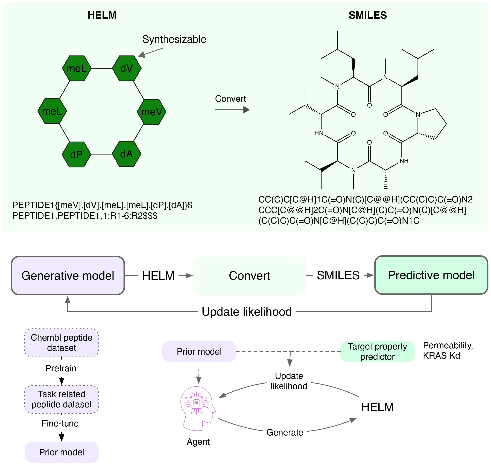

# HELM-GPT: de novo macrocyclic peptide design using generative pre-trained transformer


## Installation and running
### Clone and Create environment
Clone and create the environment.

```commandline
git clone https://github.com/charlesxu90/sgpt.git
cd sgpt

mamba env create -f environment.yml
mamba activate helm-gpt-env
```

```commandline
mamba install -c conda-forge rdkit
pip install torch==1.13.1+cu117 torchvision==0.14.1+cu117 torchaudio==0.13.1 --extra-index-url https://download.pytorch.org/whl/cu117

pip install -r requirements.txt
```

### Running the code

```shell
# Train prior model
python train_prior.py --train_data data/prior/chembl32/biotherapeutics_dict_prot_flt.csv --valid_data data/prior/chembl32/biotherapeutics_dict_prot_flt.csv --output_dir result/prior/chembl_5.0 --n_epochs 200 --max_len 200 --batch_size 1024

# Train agent model
python train_agent.py --prior result/prior/perm_tune/gpt_model_final_0.076.pt --output_dir result/agent/cpp/pep_perm_5.1_reinvent --batch_size 32 --n_steps 500 --sigma 60 --task permeability  --max_len 140

# Generate molecules from a model
python generate.py --model_path result/prior/chembl_5.0/gpt_model_34_0.143.pt --out_file result/prior/chembl_5.0/1k_samples.csv --n_samples 1000 --max_len 200 --batch_size 128
```

## License
This code is licensed under [MIT License](./LICENSE.txt).
